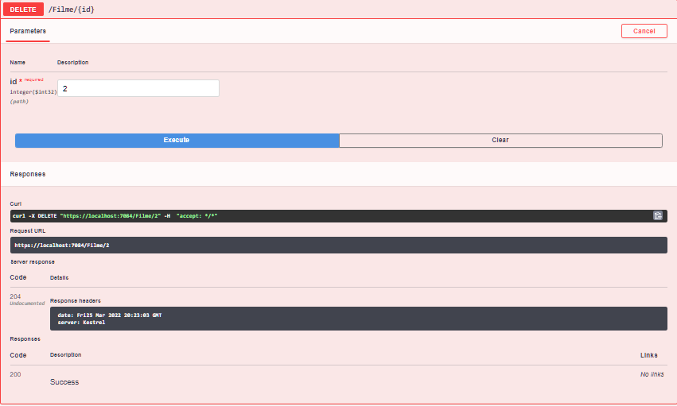

# Screenshoots: 
These are the Apis that I made to study Rest Api in .NET, I also practiced independency Injection with IMapper and DbContext.
 
I used MySql to persist the Data.
 
  

 
 
 

 
 
 
Schema:

